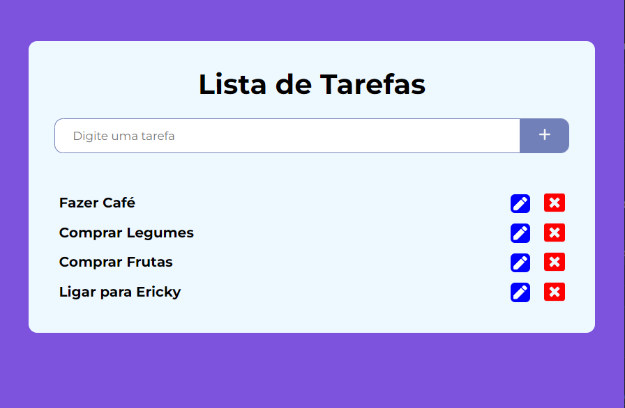
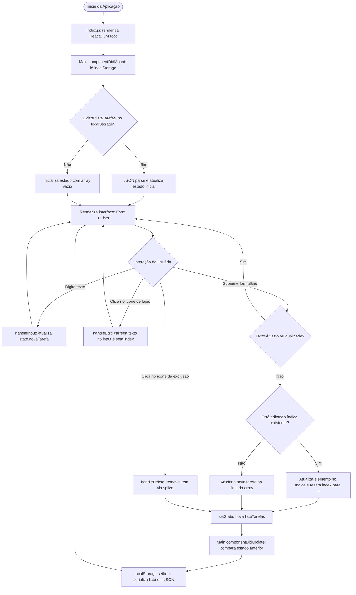

# 📝 Lista de Tarefas — Aplicação Web em React com LocalStorage

<br />

<div align="center">
  
</div>

<br />

<div align="center">

[](https://lista-tarefas-react-ericky.vercel.app/)
[](https://react.dev/)
[](https://developer.mozilla.org/pt-BR/docs/Web/JavaScript)
[](#)
[](https://react-icons.github.io/react-icons/)
[](https://eslint.org/)
[](https://prettier.io/)
[](LICENSE.md)
[](#)

</div>

---

## 🔗 Demonstração ao Vivo (Deploy)

A aplicação está hospedada e em execução contínua na plataforma **Vercel**:

👉 **[Acesse a Lista de Tarefas Online](https://lista-tarefas-react-ericky.vercel.app/)**

---

## 📖 Visão Geral

A **Lista de Tarefas React** é uma Single Page Application (SPA) responsiva e interativa voltada para a organização diária de atividades e gerenciamento de afazeres. O projeto foi estruturado para consolidar na prática os fundamentos arquiteturais do **React**, enfatizando o ciclo de vida de componentes de classe, a gerência declarativa de estado local, a imutabilidade de coleções em JavaScript e a persistência de dados localmente no navegador via **Web Storage API (LocalStorage)**.

A aplicação opera inteiramente no lado do cliente (Client-Side Only), garantindo tempo de resposta instantâneo, feedback visual em cada interação e preservação de todas as tarefas cadastradas mesmo após o fechamento ou recarregamento da página.

---

## ✨ Funcionalidades

* **Cadastro Rápido de Tarefas:** Campo de entrada com validação que permite adicionar novos afazeres através do clique no botão de adição (`FaPlus`) ou pressionando a tecla `Enter`.
* **Persistência Automática em LocalStorage:** Toda inserção, alteração ou exclusão é sincronizada em tempo real com o armazenamento local do navegador em formato JSON.
* **Edição Inline Dinâmica:** Ao clicar no ícone de edição (`FaPen`), o texto da tarefa selecionada é transportado de volta para o campo de texto principal, alterando o modo de operação do formulário para atualização no mesmo índice.
* **Exclusão de Tarefas:** Remoção seletiva e imediata de itens da lista através do ícone de cancelamento (`FaWindowClose`).
* **Prevenção de Duplicidades e Itens Vazios:** Validação automática que ignora tentativas de inclusão de tarefas sem conteúdo (apenas espaços em branco) ou com texto idêntico ao de afazeres já existentes.
* **Design Responsivo e Ergonômico:** Layout centralizado com cantos arredondados, contraste visual balanceado e efeitos de transição ao passar o cursor sobre os botões e itens da lista.

---

## 🎯 Diferenciais e Destaques Técnicos

1. **Gerenciamento do Ciclo de Vida do React:**
   * `componentDidMount()`: Executado imediatamente após a montagem do componente no DOM para ler os dados serializados em `localStorage` e popular o estado inicial (`setState`).
   * `componentDidUpdate(_prevProps, prevState)`: Executado após qualquer mutação de estado. Compara a lista atual com a anterior (`listaTarefas === prevState.listaTarefas`) para disparar a persistência em disco apenas quando houver alterações reais, otimizando o I/O do navegador.
2. **Princípio de Imutabilidade:** Atualizações no array de tarefas sempre criam novas instâncias através do operador de espalhamento (*spread operator* `[...listaTarefas]`), respeitando as boas práticas de reconciliação do Virtual DOM do React.
3. **Divisão de Responsabilidades em Componentes:**
   * `Main.js`: Componente contêiner (Smart Component) que gerencia todo o estado central e as regras de negócio.
   * `Form/index.js`: Componente de apresentação (Dumb Component) focado exclusivamente no formulário de entrada.
   * `Lista/index.js`: Componente de apresentação que renderiza a listagem de tarefas e delega eventos aos manipuladores.
4. **Checagem de Tipos Estrita com `prop-types`:** Todas as propriedades e funções passadas para os componentes filhos são validadas em tempo de desenvolvimento, assegurando integridade e documentação viva das interfaces dos componentes.
5. **Padronização de Código com ESLint e Prettier:** Configurações integradas via `.eslintrc.js` e `.prettierrc.js` com parser `@babel/eslint-parser`, forçando consistência de formatação, prevenção de variáveis não utilizadas e conformidade com os padrões modernos da comunidade React.

---

## 🏗️ Arquitetura e Estrutura de Pastas

```bash
Lista_Tarefas_React/
├── .babelrc.json                              # Configuração de presets do Babel (@babel/preset-env, @babel/preset-react)
├── .editorconfig                              # Padronização de indentação, quebras de linha e charset
├── .eslintrc.js                               # Regras de linting do código (React, Hooks, Prettier)
├── .gitignore                                 # Arquivos e diretórios excluídos do versionamento (node_modules, build, etc.)
├── .prettierrc.js                             # Configurações de formatação de código (aspas simples, largura de linha, etc.)
├── package.json                               # Manifesto do projeto com scripts e dependências
├── package-lock.json                          # Resolução de dependências exatas do npm
├── README.md                                  # Documentação técnica e guia do repositório
├── .vscode/
│   └── settings.json                          # Associação automática do caminho do Prettier no VS Code
├── public/
│   ├── index.html                             # Template HTML principal da SPA com elemento raiz #root
│   └── robots.txt                             # Diretivas para mecanismos de busca
├── screenshots/
│   └── Capturar.PNG                           # Captura de tela demonstrativa da interface em execução
└── src/
    ├── App.css                                # Estilos globais e importação da tipografia Montserrat
    ├── App.js                                 # Componente raiz da aplicação
    ├── index.js                               # Ponto de entrada do React 18 com ReactDOM.createRoot
    └── components/
        ├── Main.css                           # Estilização do card principal da aplicação
        ├── Main.js                            # Componente contêiner (Estado, Ciclo de Vida e Handlers)
        ├── Form/
        │   ├── Form.css                       # Estilização do input de texto e botão de adicionar
        │   └── index.js                       # Componente funcional do formulário com PropTypes
        └── Lista/
            ├── Lista.css                      # Estilização dos itens, efeitos de hover e botões de ação
            └── index.js                       # Componente funcional da listagem com PropTypes
```

---

## 🔄 Fluxo de Estado e Ciclo de Vida

A máquina de estados e o fluxo de persistência da aplicação seguem a sequência abaixo:



---

## 🎨 UX, Animações e Interfaces

* **Paleta de Cores Consistente:**
  * Fundo principal do body: `#7D53DE` (Roxo suave / Violeta).
  * Contêiner central (`.main`): `#EEF8FF` (Azul gelo suave para alto contraste e legibilidade).
  * Bordas e Botão de Ação: `#7180B9` (Azul acinzentado harmônico).
  * Botão de Edição (`.edit`): Azul royal com cantos arredondados e ícone branco.
  * Botão de Exclusão (`.delete`): Vermelho de alerta.
* **Tipografia:** Google Font **Montserrat** (pesos 100 a 900) aplicada globalmente com resets universais (`margin: 0`, `box-sizing: border-box`).
* **Interações Visuais e Feedback:**
  * Efeito de realce ao passar o cursor sobre as tarefas (`background-color: #f7f9f2`).
  * Efeito de filtro e redução de contraste nos ícones de ação (`filter: contrast(0.85)` e `cursor: pointer`).
  * Foco enriquecido no campo de formulário com borda de 2px destacada.

---

## 📋 Regras de Negócio e Validações

| Ação | Condição / Regra | Efeito na Aplicação |
| :--- | :--- | :--- |
| **Inclusão de Tarefa** | Campo em branco ou apenas espaços (`!tarefa.trim()`) | A operação é interrompida silenciosamente sem modificar a lista. |
| **Inclusão de Tarefa** | Tarefa já existente na lista (`listaTarefas.includes(tarefa)`) | Bloqueio imediato da inserção para impedir duplicatas. |
| **Edição de Tarefa** | Clique no botão de editar (`handleEdit`) | Altera o `state.index` para a posição selecionada e popula o input com o texto atual. |
| **Confirmação de Edição** | Envio com `index !== -1` | Substitui o valor no índice específico e restaura o ponteiro `index` para `-1`. |
| **Exclusão de Tarefa** | Clique no botão de remover (`handleDelete`) | Remove o elemento via cópia com `splice(index, 1)` e dispara atualização de estado. |
| **Persistência de Dados** | `componentDidUpdate` detecta alteração | Salva a lista atualizada com `localStorage.setItem('listaTarefas', JSON.stringify(listaTarefas))`. |

---

## 📸 Telas da Aplicação

<div align="center">
  
  <p><i>Interface web da Lista de Tarefas exibindo o formulário de inclusão, tarefas cadastradas e ações de edição/exclusão.</i></p>
</div>

---

## 📖 Passo a Passo de Uso

1. **Acessar a Aplicação:** Abra o [Link de Acesso na Vercel](https://lista-tarefas-react-ericky.vercel.app/) ou execute localmente no navegador.
2. **Adicionar Tarefa:** Digite o nome da tarefa desejada no campo de texto *"Digite uma tarefa"* e clique no botão com o ícone **+** (ou aperte Enter).
3. **Editar Tarefa:** Clique no ícone de lápis azul ao lado da tarefa que deseja alterar; o texto dela retornará ao campo de entrada para que você possa corrigi-lo. Pressione **+** para confirmar a alteração.
4. **Excluir Tarefa:** Clique no ícone vermelho de fechar (**X**) para remover definitivamente a tarefa da lista.
5. **Permanência dos Dados:** Feche a aba ou reinicie o computador; ao reabrir a página, todos os seus dados estarão salvos.

---

## 🎓 Objetivo do Projeto

Este projeto foi construído para servir como base prática e portfólio no estudo do ecossistema React, cobrindo:
* Manipulação do DOM virtual sem bibliotecas externas pesadas.
* Comunicação entre componentes pai e filho via *Props* e *Callbacks*.
* Ciclo de vida completo de componentes React (`Mount`, `Update`, `Unmount`).
* Garantia de padronização corporativa com ESLint, Prettier e EditorConfig.

---

## ⚙️ Requisitos e Instalação

### Pré-requisitos
* [Node.js](https://nodejs.org/) versão 18 LTS ou 20 LTS instalada.
* Gerenciador de pacotes `npm` ou `yarn`.
* [Git](https://git-scm.com/) instalado no sistema operacional.

### Passo a Passo

1. Clone o repositório em sua máquina:
```bash
git clone https://github.com/erickystn/Lista_Tarefas_React.git
```

2. Entre na pasta do projeto:
```bash
cd Lista_Tarefas_React
```

3. Instale todas as dependências declaradas no `package.json`:
```bash
npm install
```

---

## 🚀 Como Executar

### 1. Executar em Modo de Desenvolvimento
Inicia o servidor de desenvolvimento local com recarregamento rápido (*hot reloading*):
```bash
npm start
```
Acesse a aplicação no navegador em: `http://localhost:3000`

### 2. Gerar Build de Produção
Compila e minifica a aplicação para distribuição estática na pasta `build/`:
```bash
npm run build
```

---

## 💻 Exemplos de Uso e Código

Abaixo estão os trechos centrais responsáveis pelo funcionamento da aplicação:

### 1. Ciclo de Vida e Persistência no `localStorage` (`src/components/Main.js`)
```javascript
componentDidMount() {
  const listaTarefas = localStorage.getItem('listaTarefas');
  if (listaTarefas) {
    this.setState({ listaTarefas: JSON.parse(listaTarefas) });
  }
}

componentDidUpdate(_prevProps, prevState) {
  const { listaTarefas } = this.state;

  if (listaTarefas === prevState.listaTarefas) return;

  localStorage.setItem('listaTarefas', JSON.stringify(listaTarefas));
}
```

---

### 2. Componente de Formulário com Validação de Tipos (`src/components/Form/index.js`)
```javascript
import PropTypes from 'prop-types';
import './Form.css';
import { FaPlus } from 'react-icons/fa6';

export default function Form({ novaTarefa, handleInput, handleSubmit }) {
  return (
    <form action="#">
      <input
        type="text"
        value={novaTarefa}
        onChange={handleInput}
        placeholder="Digite uma tarefa"
      />
      <button onClick={handleSubmit}>
        <FaPlus />
      </button>
    </form>
  );
}

Form.propTypes = {
  novaTarefa: PropTypes.string.isRequired,
  handleInput: PropTypes.func.isRequired,
  handleSubmit: PropTypes.func.isRequired,
};
```

---

## 🧪 Suíte de Testes

O projeto vem configurado de fábrica com o ecossistema do Create React App contendo **Jest** e **React Testing Library**:

Para rodar a suíte de testes interativa:
```bash
npm test
```

---

## 🛠️ Tecnologias Utilizadas

| Tecnologia | Versão | Papel na Aplicação |
| :--- | :--- | :--- |
| **[React](https://react.dev/)** | `18.3.1` | Biblioteca declarativa e baseada em componentes para construção da interface. |
| **[React DOM](https://react.dev/reference/react-dom)** | `18.3.1` | Ponto de integração do React com o DOM do navegador (`ReactDOM.createRoot`). |
| **[React Icons](https://react-icons.github.io/react-icons/)** | `5.2.1` | Pacote de ícones SVG vetoriais (`FaPlus`, `FaPen`, `FaWindowClose`). |
| **[Prop-Types](https://www.npmjs.com/package/prop-types)** | `15.8.1` | Validação e tipagem de propriedades para prevenção de bugs em tempo de execução. |
| **[Web Storage API](https://developer.mozilla.org/pt-BR/docs/Web/API/Window/localStorage)** | Nativa | Persistência cliente de pares chave-valor no navegador. |
| **[ESLint](https://eslint.org/)** | `8.x` | Ferramenta de análise estática e padronização de sintaxe. |
| **[Prettier](https://prettier.io/)** | `3.3.2` | Formatador de código opinativo para garantia de legibilidade e estilo. |
| **[Vercel](https://vercel.com/)** | — | Plataforma de hospedagem e entrega contínua (CI/CD) para aplicações frontend. |

---

## 📈 Melhorias e Próximos Passos (Roadmap)

- [ ] **Refatoração para React Hooks:** Migrar o componente de classe `Main.js` para um componente funcional utilizando `useState`, `useEffect` e `useCallback`.
- [ ] **Status de Conclusão de Tarefas:** Adicionar suporte a caixas de seleção (*checkboxes*) com efeito visual de texto tachado (`line-through`) para tarefas finalizadas.
- [ ] **Filtros de Visualização:** Incluir abas de filtragem rápida (*Todas*, *Pendentes* e *Concluídas*).
- [ ] **Limpeza em Massa:** Botão dedicado para excluir todas as tarefas da lista de uma só vez com confirmação modal.
- [ ] **Reordenação com Drag and Drop:** Adicionar suporte a arrastar e soltar itens usando bibliotecas como `@hello-pangea/dnd`.
- [ ] **Tema Escuro (Dark Mode):** Alternância entre tema claro e escuro armazenando a preferência do usuário.

---

## 🤝 Como Contribuir

1. Faça um **Fork** do projeto.
2. Crie uma branch com a sua melhoria:
   ```bash
   git checkout -b feature/minha-feature
   ```
3. Commit suas alterações seguindo o padrão semântico:
   ```bash
   git commit -m "feat: adiciona status de tarefa concluida com checkbox"
   ```
4. Envie as modificações para o seu fork remoto:
   ```bash
   git push origin feature/minha-feature
   ```
5. Abra um **Pull Request** detalhando a proposta de melhoria.

---

## 👤 Autor & Créditos

* **Desenvolvedor:** [Ericky Sant'ana](https://github.com/erickystn)
* **Portfólio / Projetos:** [GitHub @erickystn](https://github.com/erickystn)
* **Deploy da Aplicação:** [Vercel](https://lista-tarefas-react-ericky.vercel.app/)

---

## 📄 Licença

Este projeto está sob a licença **MIT**. Para mais informações, consulte o arquivo de licença ou utilize o código livremente para estudos, referências e novos projetos.
